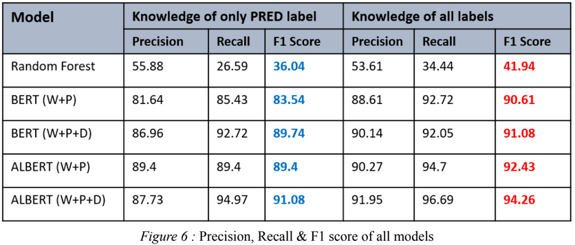

# Semantic Role Labeling on NomBank Dataset
 
* Built and analyzed deep learning models for partitive noun identification (ARG1) in the Nombank Dataset
* Utilized feature engineering to incorporate word and token level features
* Algorithms and Models reviewed include Random Forest, BERT and ALBERT.

---
### DATASET

NomBank provides argument structure for over 5000 common nouns in the Penn Treebank corpus. 
Our training set includes 84169 sentences, or
58993 ARG1 tokens. The development set
contains 3234 sentences and a total of 2343
ARG1 labels.  Our test set has 5381 sentences
with 3805 ARG1 labels.

---

### RESULTS

Paper: <a href="https://drive.google.com/file/d/1yO2YSyqY0WQLRvJILtg5eVvgV9KrLa6D/view?usp=sharing" target="_blank">Using Deep Learning to Identify ARG1 in the NomBank Dataset </a>

---
